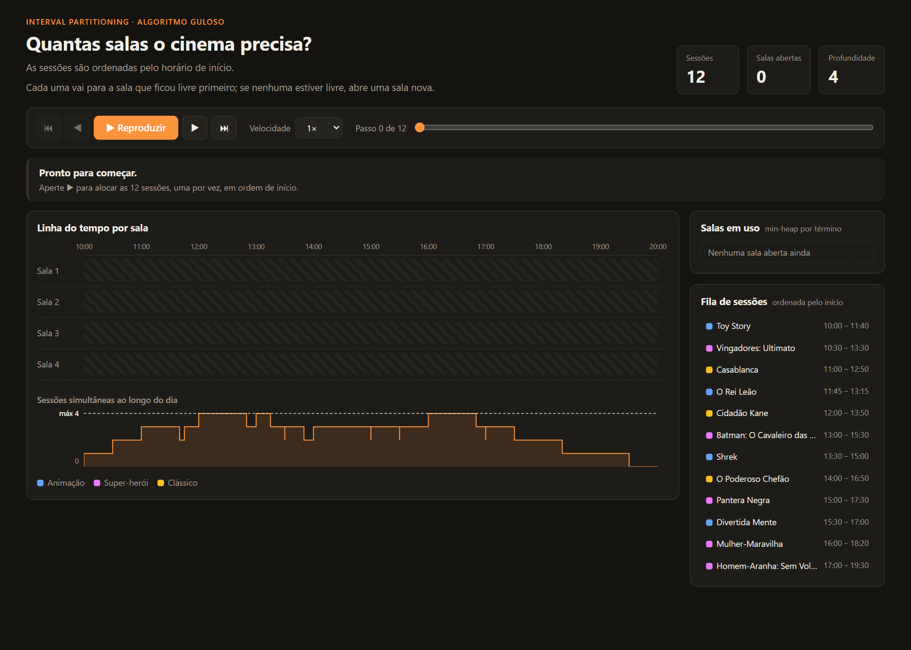
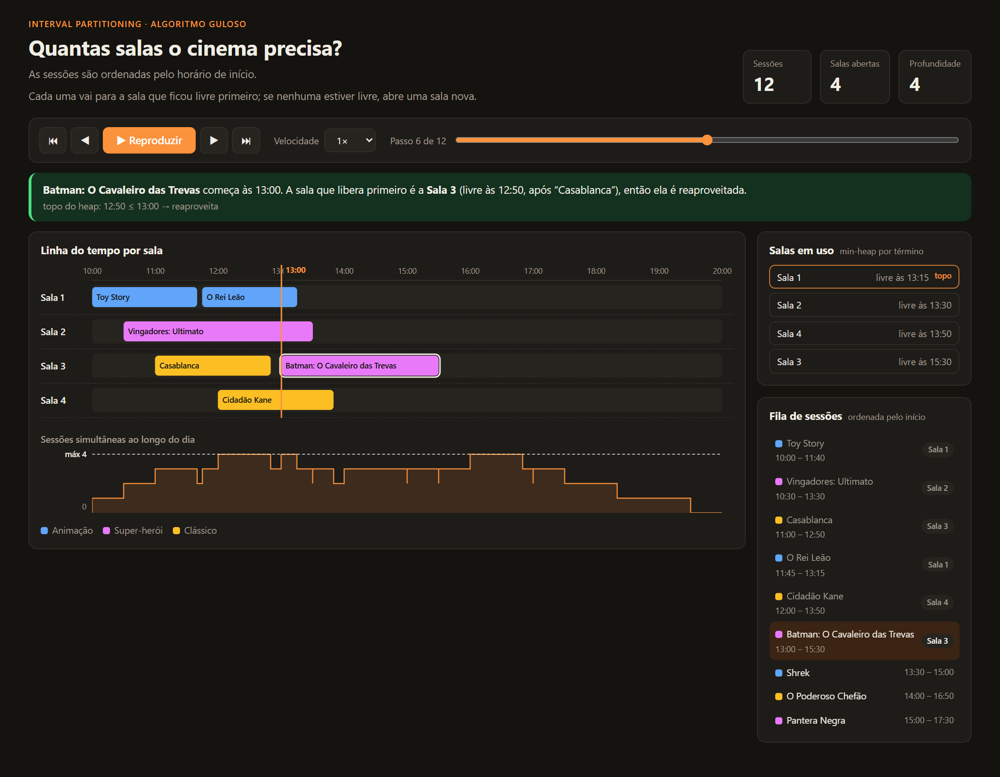
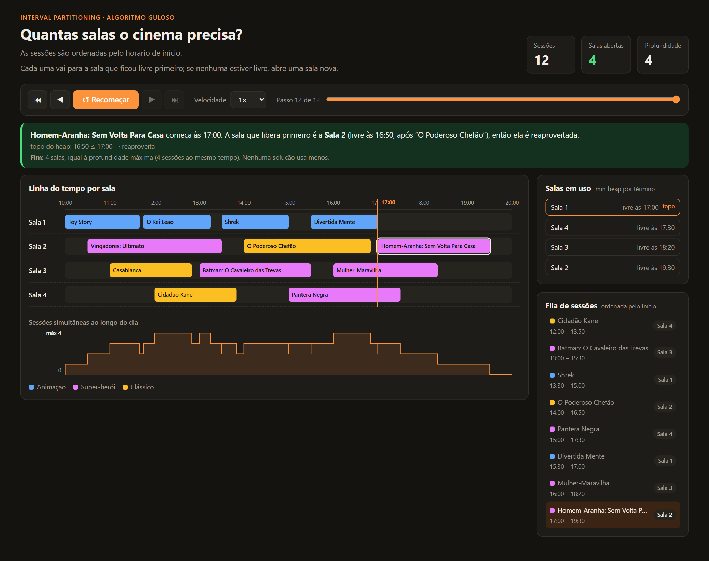

# Salas de Cinema · Interval Partitioning

**Número da Lista:** Dupla 27<br>
**Conteúdo da Disciplina:** Algoritmos Gulosos (Interval Partitioning)

Vídeo Apresentação: https://youtu.be/1KSigTWrfAM

## Alunos

| Matrícula | Aluno |
| --- | --- |
| 24/2015960 | Thiago Henrique Machado de Souza |
| 24/2015915 | Luiz Gustavo da Conceição Souza |

## Sobre

Aplicação web que responde a uma pergunta prática: **qual é o menor número de salas que um cinema precisa para exibir todas as sessões do dia sem que duas delas ocupem a mesma sala ao mesmo tempo?**

O problema é resolvido com o algoritmo guloso de **Interval Partitioning**. A interface mostra o algoritmo funcionando passo a passo: cada sessão é alocada em tempo real em uma linha do tempo por sala, junto com o estado da fila de prioridade (min-heap) e a justificativa de cada decisão. Assim, dá para ver qual sala cada filme recebeu e também o motivo de o algoritmo ter reaproveitado uma sala ou aberto uma nova.

## Como o algoritmo funciona

1. As sessões são **ordenadas pelo horário de início**.
2. As salas em uso ficam em um **min-heap** ordenado pelo horário de término da última sessão de cada sala. O topo do heap é a sala que fica livre mais cedo.
3. Para cada sessão, em ordem:
   - se a sala do topo já estiver livre (`término ≤ início`), ela é **reaproveitada**;
   - caso contrário, nenhuma sala está livre e uma **sala nova** é aberta.
4. A sala usada volta para o heap com o novo horário de término.

Uma sessão que começa exatamente no horário em que outra termina pode usar a mesma sala, porque os intervalos são tratados como `[início, fim)`.

**Corretude:** o número de salas abertas é igual à **profundidade** da programação, ou seja, ao maior número de sessões que acontecem ao mesmo tempo. Como nenhuma solução pode usar menos salas do que a profundidade, a solução gulosa é ótima.

**Complexidade:** `O(n log n)`, que vem da ordenação inicial e de uma operação de heap por sessão.

## Funcionalidades

- **Linha do tempo por sala**, preenchida sessão a sessão, com uma linha marcando o horário que está sendo processado.
- **Reprodução passo a passo**, com controles de reproduzir/pausar, avançar, voltar, ir ao fim e ajuste de velocidade (0,5× a 4×).
- **Explicação de cada decisão**, que compara o topo do heap com o início da sessão (ex.: `12:50 ≤ 13:00 → reaproveita`).
- **Estado do min-heap** a cada passo, com a sala do topo destacada.
- **Fila de sessões** ordenada pelo início, mostrando a sala atribuída a cada uma. Clicar em uma sessão leva direto àquele passo.
- **Gráfico de sessões simultâneas**, que mostra a profundidade ao longo do dia e deixa visível que salas usadas = profundidade máxima.
- **Atalhos de teclado:** `Espaço` (reproduzir/pausar), `←` / `→` (passo anterior/próximo), `Home` / `End` (início/fim).

## Screenshots

**Estado inicial**, antes da alocação:



**Passo a passo**: no passo 6, a Sala 3 é reaproveitada para *Batman* porque *Casablanca* terminou às 12:50:



**Resultado final**: 12 sessões alocadas em 4 salas, igual à profundidade máxima da programação:



## Estrutura do projeto

```
├── app/
│   ├── __init__.py                 # cria o app Flask e registra as rotas
│   ├── core/
│   │   ├── filmes.py               # programação de sessões do dia
│   │   └── interval_partitioning.py# implementação do algoritmo
│   ├── routes/
│   │   └── api.py                  # endpoints da API
│   ├── static/                     # CSS e JavaScript do front
│   └── templates/
│       └── index.html              # página de visualização
├── images/                         # screenshots do README
├── requirements.txt
└── run.py                          # ponto de entrada da aplicação
```

### API

| Método | Rota | Descrição |
| --- | --- | --- |
| `GET` | `/api/filmes` | Lista as sessões do dia (título, categoria, início e fim). |
| `POST` | `/api/particionar` | Executa o algoritmo e retorna o número de salas, a alocação de cada sessão e o registro de eventos. |

## Instalação

**Linguagem:** Python 3.10+<br>
**Framework:** Flask

1. Crie um ambiente virtual:

   ```
   python -m venv venv
   ```

2. Ative o ambiente:

   - Windows: `.\venv\Scripts\activate`
   - Linux / macOS: `source venv/bin/activate`

3. Instale as dependências:

   ```
   pip install -r requirements.txt
   ```

## Como rodar

Com o ambiente virtual ativo, execute:

```
python run.py
```

Depois, acesse a aplicação em:

```
http://127.0.0.1:5000
```
